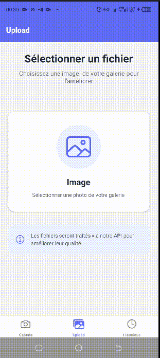
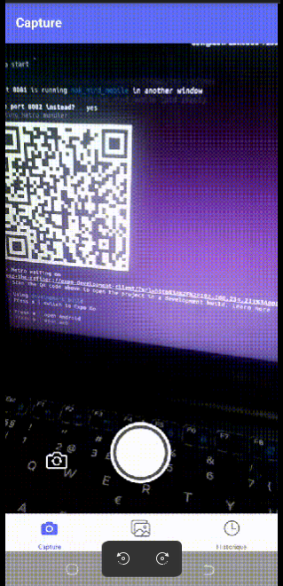

# The Refiner (TR)

Application mobile de traitement média par API développée avec React Native et Expo.

## 📱 Fonctionnalités

- **Capture Photo**: Prenez des photos et appliquez des filtres via l'API
- **Upload de Fichiers**: Sélectionnez des images existantes pour traitement
- **Historique**: Consultez tous vos médias traités
- **Sauvegarde Locale**: Enregistrez les résultats dans votre galerie
<p align="center">
  
  
</p>
## 🚀 Installation

### Prérequis

- Node.js (v16 ou supérieur)
- npm ou yarn
- Expo CLI (`npm install -g expo-cli`)
- Expo Go app sur votre appareil mobile (iOS/Android)

### Configuration

1. Clonez le dépôt:
```bash
git clone <votre-repo>
cd the-refiner
```

2. Installez les dépendances:
```bash
npm install
```

3. Configurez l'API:
   - Ouvrez `src/services/api.js`
   - Remplacez `API_BASE_URL` par l'URL de votre API
   - Mettez `USE_MOCK_API` à `false` pour utiliser une vraie API

## 🎯 Lancement

### Démarrer le serveur de développement:
```bash
npm start
```

### Lancer sur iOS:
```bash
npm run ios
```

### Lancer sur Android:
```bash
npm run android
```

### Scanner le QR Code:
- Ouvrez l'app Expo Go sur votre téléphone
- Scannez le QR code affiché dans le terminal

## 🔌 Endpoints API

L'application utilise les endpoints suivants:

### POST /api/process/image
Traite une image capturée par la caméra.

**Body (multipart/form-data):**
- `image`: Fichier image (JPEG)
- `filter`: Type de filtre (string)

**Response:**
```json
{
  "success": true,
  "processedUrl": "https://...",
  "processingTime": 2.1,
  "enhancement": "brightness_contrast"
}
```

### POST /api/upload/file
Upload et traite un fichier existant (image ).

**Body (multipart/form-data):**
- `file`: Fichier média
- `type`: Type de fichier (image)

**Response:**
```json
{
  "success": true,
  "processedUrl": "https://...",
  "processingTime": 3.2,
  "fileType": "image"
}
```

## 📁 Structure du Projet

```
the-refiner/
├── App.js                      # Point d'entrée principal avec ErrorBoundary
├── app.json                    # Configuration Expo
├── package.json                # Dépendances
├── src/
│   ├── screens/               # Écrans de l'application
│   │   ├── CameraScreen.js    # Capture photo avec traitement
│   │   ├── GalleryScreen.js   # Upload fichiers depuis galerie
│   │   └── HistoryScreen.js   # Historique des médias traités
│   ├── services/              # Services
│   │   ├── api.js            # Intégration API (mock + réel)
│   │   └── storage.js        # Stockage local AsyncStorage
│   ├── components/            # Composants réutilisables
│   │   ├── LoadingOverlay.js  # Indicateur de chargement
│   │   ├── PermissionGuard.js # Garde de permissions
│   │   └── ErrorBoundary.js   # Gestion des erreurs React
│   └── utils/                 # Utilitaires
│       └── permissions.js     # Helpers de permissions
└── assets/                    # Images et ressources
```

## 🔐 Permissions

L'application nécessite les permissions suivantes:

### iOS
- **NSCameraUsageDescription**: Capture de photos et vidéos
- **NSPhotoLibraryUsageDescription**: Sélection de médias
- **NSPhotoLibraryAddUsageDescription**: Sauvegarde dans la galerie

### Android
- **CAMERA**: Accès à la caméra
- **READ_EXTERNAL_STORAGE**: Lecture de la galerie
- **WRITE_EXTERNAL_STORAGE**: Écriture dans la galerie
- **READ_MEDIA_IMAGES**: Lecture des images (Android 13+)
<!-- - **READ_MEDIA_VIDEO**: Lecture des vidéos (Android 13+) -->

Ces permissions sont automatiquement demandées au premier lancement. Si refusées, l'utilisateur peut les activer via les paramètres de l'appareil.

## 🛠️ Technologies

- **React Native 0.81.5**: Framework mobile
- **Expo 54**: Plateforme de développement
- **expo-camera 17.0**: Capture photo
- **expo-image-picker 17.0**: Sélection de fichiers
- **expo-file-system 19.0**: Gestion des fichiers
- **expo-media-library 17.0**: Sauvegarde dans la galerie
<!-- - **expo-av 16.0**: Lecture vidéo -->
- **axios 1.13**: Requêtes HTTP
- **React Navigation 6.5.20**: Navigation entre écrans
- **@react-native-async-storage 2.2**: Stockage local

## 📝 Mode Développement

Par défaut, l'application utilise une API simulée (`USE_MOCK_API = true`) qui:
- Simule un délai de traitement de 2-3 secondes
- Retourne des images de démonstration depuis Picsum
- Permet de tester l'application sans backend

Pour utiliser une vraie API:
1. Ouvrez `src/services/api.js`
2. Changez `USE_MOCK_API` à `false`
3. Définissez `API_BASE_URL` avec votre URL d'API

## 🎨 Fonctionnalités Détaillées

### 1. Capture Photo (CameraScreen)
- Capture via caméra avant/arrière
- Prévisualisation avant traitement
- Traitement asynchrone via API
- Comparaison original vs amélioré
- Sauvegarde dans galerie + historique

### 2. Upload Galerie (GalleryScreen)
- Sélection d'images <!-- ou vidéos -->
<!-- - Support des deux types de médias -->
- Traitement<!--  asynchrone-->
<!-- - Prévisualisation avec lecteur vidéo -->
- Sauvegarde complète

<!-- ### 3. Traitement Real-time (RealtimeScreen)
- Vue divisée (caméra + traité)
- Capture automatique 2-3 FPS
- Affichage des statistiques (FPS, frames)
- Simulation de flux vidéo continu
- Contrôles start/stop -->
<!-- │   │   ├── RealtimeScreen.js  # Traitement real-time (2-3 FPS) -->


### 3. Historique (HistoryScreen)
- Liste de tous les médias traités
- Vue détaillée avec comparaison
- Suppression individuelle ou totale
- Pull-to-refresh
- Métadonnées (date, source, type)

## 🐛 Gestion des Erreurs

L'application gère les erreurs suivantes:

### Permissions
- Demande automatique au premier lancement
- Messages clairs si refusées
- Redirection vers paramètres système
- Composant PermissionGuard pour protection

### API
- Timeouts configurables (30s images, 60s vidéos)
- Messages d'erreur personnalisés
- Retry automatique possible
- Mode mock pour développement

### Erreurs React
- ErrorBoundary global
- Affichage d'erreur convivial
- Bouton de réinitialisation
- Logs détaillés en mode dev

## 🚀 Déploiement

### Build iOS
```bash
expo build:ios
```

### Build Android
```bash
expo build:android
```

### Publication Expo
```bash
expo publish
```

## 📄 Licence

MIT

